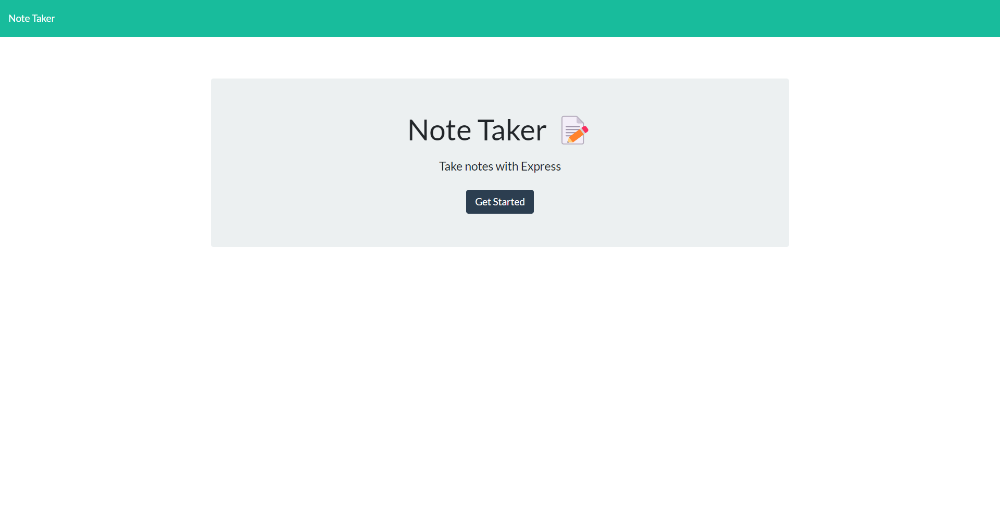

# Note Taker
  
  ### Description
  An application that can be used to write and save notes.
  ### Table of Contents
  * [Installation](#installation)
  * [Usage](#usage)
  * [Contributions](#contributions)
  * [Tests](#tests)
  * [Screenshot](#screenshot)
  * [Link](#link)
  * [Questions](#questions)

  ### Installation
  From the root of your project in the command line run the command 'npm install'. (You must have Node.js installed on your computer to run these commands.)
  ### Usage
  Activate the server by running the command 'npm start' in the command line. 
  ### Contributions
  Contributions coming soon!
  ### Tests
  Tests coming soon!
  ### Screenshot
  
  ### Link
  [Deployed Link](https://safe-tundra-12405.herokuapp.com/)
  ### Questions
  If you have additional questions, you can contact me here: knharman@gmail.com
  Check out my GitHub: [knharman](https://github.com/knharman)